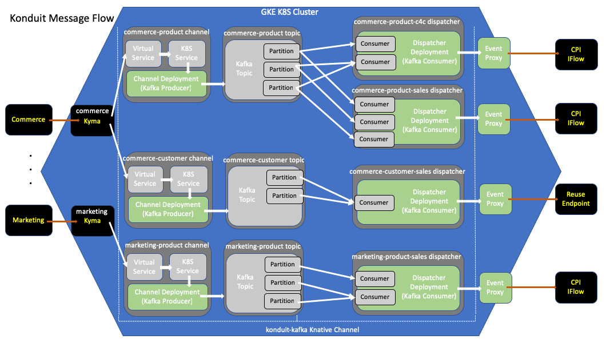

# Knative Kafka

This project is a Knative implementation of a Kafka backed Channel.  
It is being developed during the early stages of the Knative Eventing implementation in parallel with
the official Kafka Channel implementation.  The primary rationale for a second Kafka Channel implementation 
is to provide the advanced functionality and customization.

The deployment is implemented for the production use case whereby a single deployment supports all channel 
instances in the K8S cluster.   

The following applications comprise the total **knative-kafka** solution...

- [konduit-kafka-common](./components/common/README.md) - Common code used by the other Knative-Kafka components.

- [konduit-kafka-channel](./components/channel/README.md) - The public service of the Channel to which inbound 
messages are sent.  This is a simple golang REST client which writes messages to the corresponding Kafka Topic.
This is the "Producer" from the Kafka perspective. The knative-kafka-controller creates a single instance of 
this application for each Knative Channel CustomResource.
    
- [konduit-kafka-controller](./components/controller/README.md) - This component implements the channel controller created 
against Knative Eventing 0.8.0 and is mostly aligned with that version.  It
was generated with Kubebuilder and includes the KafkaChannel CRD. This should not be confused with the 
Knative Eventing Contrib Kafka Channel of which you should only install one. 

- [konduit-kafka-dispatcher](./components/dispatcher/README.md) - This application runs the Kafka ConsumerGroup 
responsible for processing messages from the corresponding Kafka Topic.  This is the "Consumer" from the Kafka
perspective.  The  knative-kafka-controller creates a single instance of this application for each Knative Subscription 
CustomResource. 

The following diagram shows the message flow through the various components. 



## Installation

For installation and configuration instructions please see the helm chart [README](./resources/README.md)  

## Support Tooling
The following are one time install of required tools
```
# Install Go (If not already installed)
brew install go

# Install Dep (If not already installed)
brew install dep
brew upgrade dep

# Install Confluent Go Client Dependencies
brew install pkg-config
brew install librdkafka

# If the current version of librdkafka from brew doesn't work with the konduit-kafka components then you can roll back to an older version via the following.
curl -LO https://github.com/edenhill/librdkafka/archive/v1.0.1.tar.gz \
  && tar -xvf v1.0.1.tar.gz \
  && librdkafka-1.0.1 \
  && ./configure \
  && make \
  && sudo make install
```
